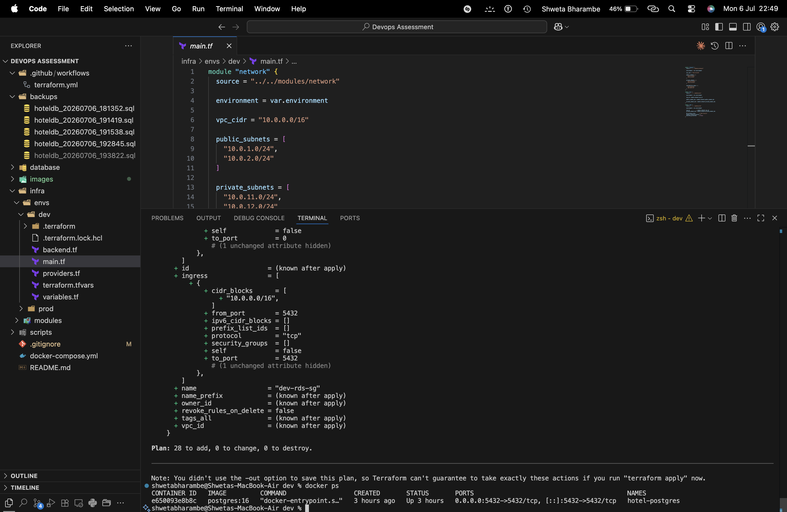
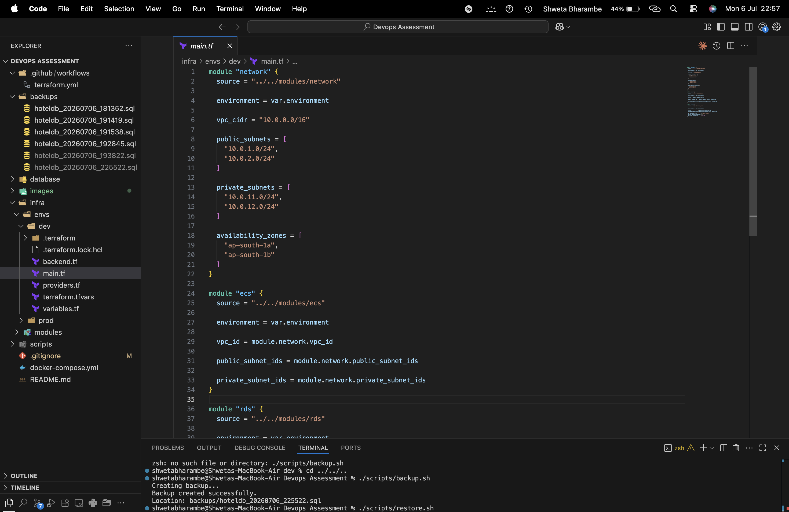
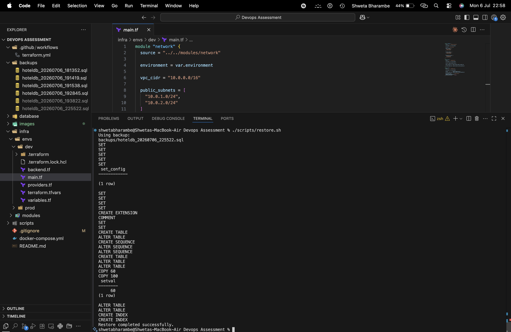

# DevOps Assessment

## Overview

This repository contains the solution for the DevOps Assessment. The project demonstrates Infrastructure as Code (IaC), containerized database setup, backup & restore automation, and CI validation.

## Features

- Infrastructure provisioning using Terraform
- Modular Terraform architecture
- Separate Development and Production environments
- AWS VPC with Public and Private Subnets
- Internet Gateway and NAT Gateway
- ECS Fargate Cluster
- Application Load Balancer (ALB)
- PostgreSQL RDS configuration
- Docker Compose for local PostgreSQL
- Database schema migration
- Sample data generation (100+ hotel bookings)
- Query optimization using indexes
- Automated database backup and restore scripts
- GitHub Actions workflow for Terraform validation

---

# Project Structure

```
Devops-Assessment/
│
├── .github/
│   └── workflows/
│       └── terraform.yml
│
├── infra/
│   ├── envs/
│   │   ├── dev/
│   │   └── prod/
│   │
│   └── modules/
│       ├── network/
│       ├── ecs/
│       └── rds/
│
├── database/
│   ├── migrations/
│   │   └── init.sql
│   │
│   └── seeds/
│       └── seed.sql
│
├── scripts/
│   ├── backup.sh
│   └── restore.sh
│
├── backups/
│
├── docker-compose.yml
├── README.md
└── .gitignore
```

---

# Architecture

```


Local Development

Docker Compose
      │
      ▼
 PostgreSQL Container
```

---

# Technologies Used

- Terraform
- AWS VPC
- AWS ECS Fargate
- AWS ALB
- AWS RDS PostgreSQL
- Docker Compose
- PostgreSQL
- Bash
- GitHub Actions

---

# Terraform


## Development Environment

```bash
cd infra/envs/dev

terraform init

terraform fmt

terraform validate

terraform plan
```

## Production Environment

```bash
cd infra/envs/prod

terraform init

terraform fmt

terraform validate

terraform plan
```

---

# Local Database Setup



Start PostgreSQL

```bash
docker compose up -d
```

Verify container

```bash
docker ps
```

Connect to PostgreSQL

```bash
docker exec -it hotel-postgres psql -U postgres -d hoteldb
```

List tables

```sql
\dt
```

---

# Database Migration

Schema is located in

```
database/migrations/init.sql
```

It creates

- hotel_bookings
- booking_events

---

# Seed Data

Seed file

```
database/seeds/seed.sql
```

The script inserts

- 100 Hotel Booking records
- 60 Booking Event records

Verify

```sql
SELECT COUNT(*) FROM hotel_bookings;

SELECT COUNT(*) FROM booking_events;
```

Expected

```
hotel_bookings : 100

booking_events : 60
```

---

# Query Optimization

The following query was optimized:

```sql
SELECT
    org_id,
    status,
    COUNT(*),
    SUM(amount)
FROM hotel_bookings
WHERE city='delhi'
AND created_at >= NOW() - INTERVAL '30 days'
GROUP BY org_id,status;
```

Indexes created

```sql
CREATE INDEX idx_city_created
ON hotel_bookings(city, created_at);

CREATE INDEX idx_org_status
ON hotel_bookings(org_id, status);
```

Performance was verified using

```sql
EXPLAIN ANALYZE
```

---

# Backup



Create backup

```bash
./scripts/backup.sh
```

Example output

```
Creating backup...

Backup created successfully.

Location:
backups/hoteldb_20260706_192845.sql
```

---

# Restore



Restore latest backup

```bash
./scripts/restore.sh
```

Example output

```
Restore completed successfully.
```

Verify

```sql
SELECT COUNT(*) FROM hotel_bookings;

SELECT COUNT(*) FROM booking_events;
```

---

# GitHub Actions

Terraform validation workflow automatically executes on Pull Requests.

Workflow includes

- terraform init
- terraform fmt
- terraform validate
- terraform plan

Workflow file

```
.github/workflows/terraform.yml
```

---

# Assumptions

- Terraform is used for infrastructure provisioning.
- Docker Compose is used only for local PostgreSQL testing.
- AWS resources are defined but do not need to be deployed for local verification.
- Backup and restore scripts operate on the local PostgreSQL container.

---

# Future Improvements

- Terraform Remote State (S3 + DynamoDB)
- Secrets management using AWS Secrets Manager
- ECS Auto Scaling
- CloudWatch monitoring and alarms
- CI/CD deployment pipeline
- Automated database migrations using Flyway or Liquibase

---

# Author

**Shweta Bharambe**

GitHub: https://github.com/ShwetaBharambe21
